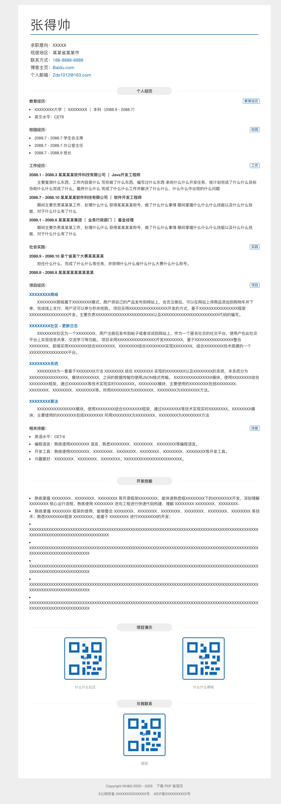
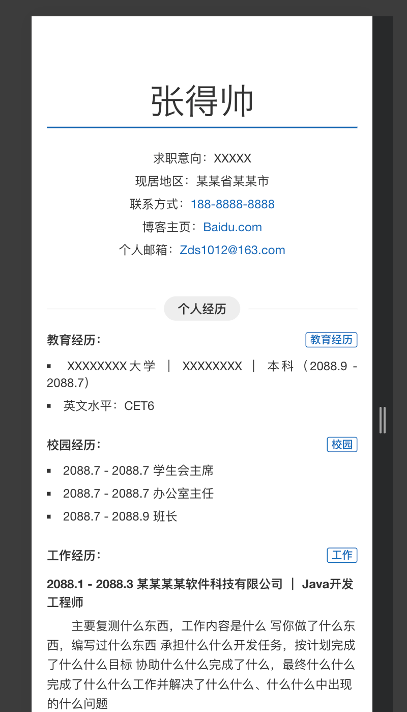

# render-resume

一份简约的在线简历模板，基于 Vite 构建。项目现在把“文本内容 / 简历配置”和“样式 / 渲染逻辑”分开：

## 效果预览
Github Pages部署：https://zhskevin.github.io/render-resume/

静态代码分支：https://github.com/ZhsKevin/render-resume/tree/master

PC端：



移动端：



## 环境要求

- Node.js 20 或更高版本
- npm 10 或更高版本
- Git

## 快速开始

### 本地拉取启动项目
```bash
git clone git@github.com:ZhsKevin/render-resume.git
npm install
npm run dev
```
### 目录结构

- `index.html`：放简历文本、链接、图片路径、页面标题等配置。
- `src/main.scss`：只放样式。
- `src/main.js`：只读取 `index.html` 里的配置并渲染页面。

### 实时对照修改简历内容

简历内容位于 `index.html` 的 JSON 中，直接编辑即可

### 修改完成后生成静态页面文件

```bash
npm run build
```

输出目录如下：

```text
dist/
├── assets/
│   ├── index.css
│   ├── index.js
│   ├── profile-photo.jpg
│   └── qrcode-placeholder.svg
└── index.html
```

生产构建已关闭压缩和哈希文件名，所以 `index.js` 和 `index.css` 会保持相对可读。

## 发布页面

项目为保持更轻量已移除内置发布依赖，所以需要手动把整个 `dist/` 下的文件上传到你的静态托管服务，例如 GitHub Pages、对象存储、Nginx、宝塔面板或 CDN 控制台。

如此分支是已经发布好的文件直接上传后的效果：https://github.com/ZhsKevin/render-resume/tree/master

开启githubpages功能后则可直接访问。同理其余对象存储服务商均可提供此类似功能，推荐主流对象存储云服务商如阿里云OOS，腾讯云COS等。

也可以使用脚本把本次生成的 `dist/` 内容发布到指定 GitHub 分支：

```bash
npm run publish:dist -- branch master
```

这个命令会先执行 `npm run build`，然后在临时目录中拉取目标分支，清空旧文件，复制 `dist/` 内容，提交并推送到 `origin/master`。脚本不会切换当前工作区分支。

## 命令速查

```bash
# 初始化安装依赖
npm install
# 启动本项目
npm run dev
# 生成静态页面
npm run build
# 发布 dist下的文件到 master 分支
npm run publish:dist -- branch master
```


# 常见问题

### 改了文案是否要重新构建？

构建后，如果只是改一个文案、链接或标点等可渲染的非样式内容，可以直接改 `dist/index.html`，不需要重新生成 JS 和 CSS。不需要重新构建。

如果改的是源码里的 `index.html`，需要重新执行 `npm run build` 才会更新 `dist/index.html`。

### 图片不显示？

确认图片在 `assets/` 中，并且 `index.html` 里使用的是类似 `assets/wechat-qr.png` 的相对路径。

### JS/CSS 为什么不压缩？

这是刻意设置的。项目更重视部署后可维护性，因此 `vite.config.js` 里关闭了生产压缩和哈希文件名。

### 文本怎么局部加粗？ / 我的星号消失了？

简历文案支持用一对星号标记局部加粗：
```json
{
  "name": "2088.1 - 2088.3  某某某某软件*科技*有限公司 ｜ Java开发工程师"
}
```

页面会显示为“某某某某软件科技有限公司”，其中“科技”加粗。这个写法适用于标题、列表项、描述、个人信息、页脚等普通文本。

如果确实需要显示星号本身，并且它刚好会被识别成加粗标记，可以在 JSON 里写 `\\*`：

```json
{
  "name": "这里显示星号：\\*"
}
```

### 简历内容字段怎么写？

纯列表内容使用 `items`，适合教育经历、校园经历、相关技能：

```json
{
  "title": "教育经历：",
  "tag": "教育经历",
  "items": [
    "XXXXXXXX大学 ｜ XXXXXXXX ｜ 本科（2088.9 - 2088.7）",
    "英文水平：CET6"
  ]
}
```

带标题的经历使用 `lists`，工作经历、社会实践、项目经历都用这一套：

```json
{
  "title": "项目经历：",
  "tag": "项目",
  "lists": [
    {
      "name": "XXXXXXXX商城",
      "href": "https://baidu.com",
      "frontsize": 1.2,
      "dtoList": [
        "第一条说明",
        "第二条说明"
      ]
    }
  ]
}
```

`name` 是条目标题；有 `href` 时，`name` 会自动显示为链接。`dto` 是普通段落，`dtoList` 是多条圆点说明。`frontsize` 是 `name` 的倍率，例如 `1.2` 表示在默认字号基础上等比放大 20%，行高也会同步放大。

### 长文本怎么编辑？

`index.html` 里的配置是标准 JSON，双引号字符串内部不能直接敲真实换行。下面这种写法会让编辑器标红：

```json
{
  "dto": [
    "第一句文字
    第二句文字"
  ]
}
```

推荐把长文本拆成多个数组项，编辑时自然换行，页面渲染时仍然会合并成同一段自然排版：

```json
{
  "dto": [
    "第一句文字",
    "第二句文字",
    "第三句文字"
  ]
}
```

### 长文本怎么换行编辑？
如果确实想让页面显示为多行，可以使用 `dtoList`，此时逗号即代表换行：

```json
{
  "name": "2021.7 - 2025.7  泛微网络科技股份有限公司 ｜ 流程引擎组 ｜ Java开发工程师",
  "dtoList": [
    "第一行文字",
    "第二行文字",
    "第三行文字"
  ]
}
```

`dtoList` 里的每一项都会显示成一条圆点说明，也支持 `*局部加粗*`。


### 怎么配置证件照？

证件照开关在 `index.html` 的 `profilePhoto` 字段中，建议选择白底证件照：

```json
{
  "profilePhoto": {
    "enabled": false,
    "src": "assets/profile-photo.jpg",
    "alt": "证件照"
  }
}
```

- `enabled: false`：不显示证件照，页面保持无照片布局。
- `enabled: true`：显示证件照，顶部蓝色线会缩短到照片左侧。
- `src`：图片路径。建议把证件照放到 `assets/profile-photo.jpg`，构建后路径仍然是 `assets/profile-photo.jpg`。

## 怎么配置二维码和图片？

公共图片放在：

```text
assets/
```

构建后会复制到：

```text
dist/assets/
```

配置图片时，在 `index.html` 中写构建后的相对路径：

```json
{
  "caption": "微信",
  "image": "assets/qrcode-placeholder.svg",
  "alt": "微信二维码"
}
```

替换成自己的图片时，把文件放进 `assets/`，再把 `image` 改成对应路径即可，例如：

```json
{
  "caption": "微信",
  "image": "assets/wechat-qr.png",
  "alt": "微信二维码"
}
```

## 配置网站 Logo

浏览器标签页上的网站 logo 使用 favicon 配置，在 `index.html` 的 `<head>` 中：

```html
<link rel="icon" href="assets/site-logo.svg" type="image/svg+xml">
```

默认文件位置：

```text
assets/site-logo.svg
```

如果要替换成自己的 logo，直接替换这个文件即可。也可以改成其他文件名，例如：

```html
<link rel="icon" href="assets/favicon.png" type="image/png">
```

## 配置样式

样式文件是：

```text
src/main.scss
```

常改项：

- `$theme-color`：主题蓝色。
- `$text-color`：正文颜色。
- `$page-bg`：页面背景色。
- `.content`：简历纸张宽度和外边距。
- `.content-hd .name h1`：姓名字号、字重、字距。
- `@media screen and (max-width: 720px)`：手机端样式。

样式变化需要重新执行 `npm run build`，因为 CSS 是从 `src/main.scss` 生成的。


### 配置自定义域名

如需自定义域名，创建：

```text
public/CNAME
```

内容只写域名本身，不要写 `https://`。

构建时，Vite 会自动把它复制到 `dist/CNAME`。
