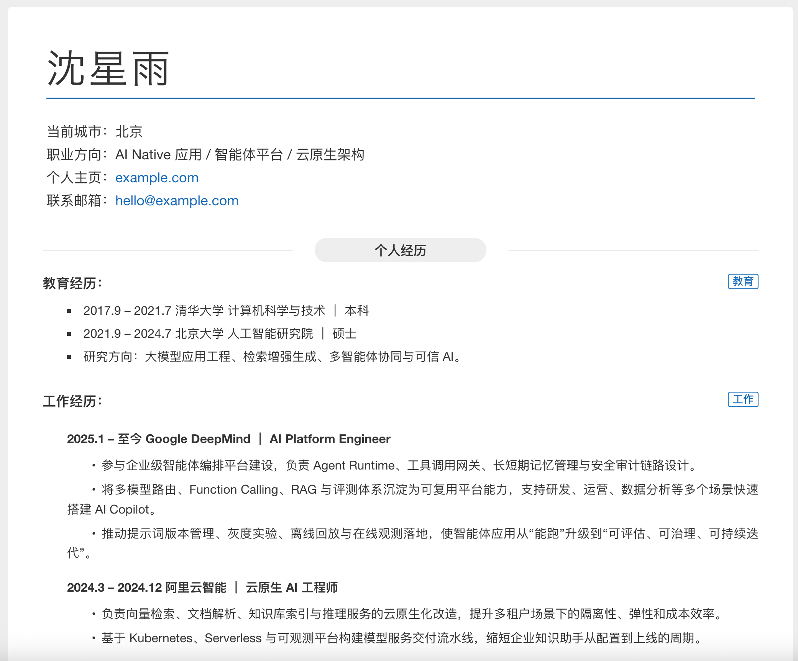
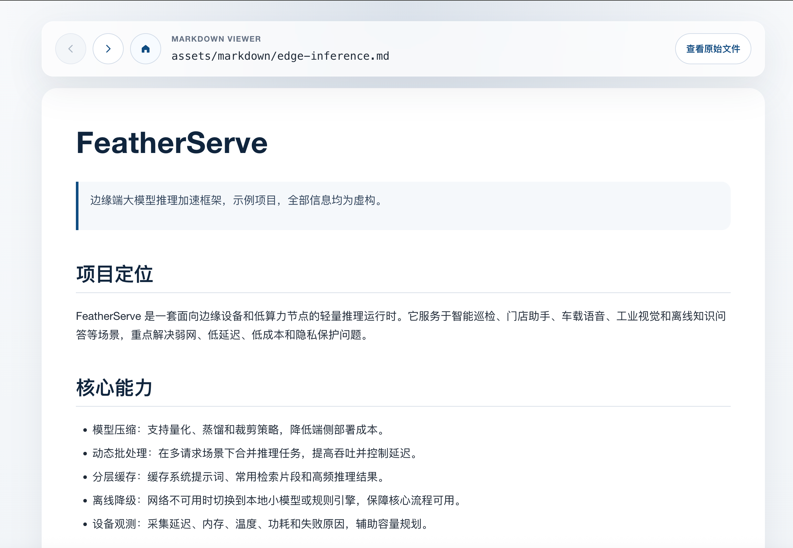
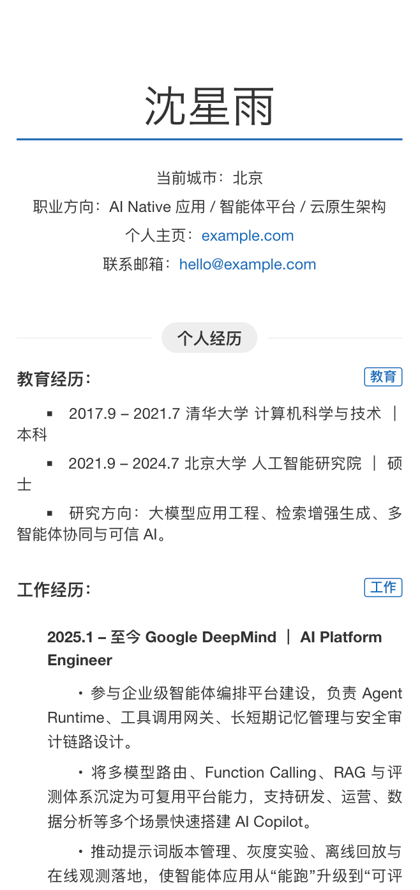

# render-resume

一个轻量、可部署、可继续二次开发的在线简历与作品集模板。内容写在 `index.html` 的 JSON 里，项目详情写成 Markdown，构建后就是一份可以直接托管到 GitHub Pages、对象存储、Nginx 或 CDN 的静态站点。

[在线预览](https://zhskevin.github.io/render-resume/) · [常见问题](docs/QA.md) · [示例项目目录](assets/markdown/project-guide.md)


## 预览
Github Pages部署：https://zhskevin.github.io/render-resume/

静态代码分支：https://github.com/ZhsKevin/render-resume/tree/master

PC 端：



解析markdown文件：



移动端：





## 特性

- `JSON` 驱动简历内容：姓名、基础信息、经历、项目、二维码和页脚都集中在 `index.html` 中。
- 内置 Markdown 详情页：项目条目可以跳到 `assets/markdown/*.md`，适合写更完整的项目介绍、设计说明或作品集文章。
- 静态部署友好：`npm run build` 后上传整个 `dist/` 即可，无服务端依赖。
- 构建产物可读：生产构建关闭 JS/CSS 压缩，方便部署后做轻量排查或文案修正。
- 响应式与打印友好：默认覆盖桌面端、移动端和打印场景。
- 资源目录清晰：图片放在 `assets/imgs/`，Markdown 放在 `assets/markdown/`，PDF 等附件放在 `assets/files/`。

## 快速开始

```bash
git clone git@github.com:ZhsKevin/render-resume.git
cd render-resume
npm install
npm run dev
```

开发服务默认运行在：

```text
http://localhost:9991
```

生成静态页面：

```bash
npm run build
```

预览构建结果：

```bash
npm run preview
```

## 如何修改内容

主要改这几处就够了：

- `index.html`：简历主体数据，包含基础信息、经历、项目链接、二维码和页脚。
- `assets/markdown/`：项目详情页，每个 `.md` 文件都可以通过 `mdviewer.html?file=assets/markdown/xxx.md` 打开。
- `assets/imgs/`：头像、二维码、备案图标、站点图标等公开图片。
- `assets/files/`：PDF 简历或其他可下载附件。
- `src/main.scss`：简历页面样式。
- `src/mdviewer.scss`：Markdown 查看器样式。

项目链接示例：

```json
{
  "name": "Orion AgentMesh｜企业级智能体编排平台",
  "href": "mdviewer.html?file=assets/markdown/agent-mesh.md",
  "dtoList": [
    "面向企业内部复杂流程打造的多智能体协作平台。",
    "支持任务拆解、工具调用、审计回放与权限隔离。"
  ]
}
```

## 目录结构

```text
.
├── 404.html
├── index.html
├── mdviewer.html
├── assets/
│   ├── files/
│   │   └── resume.pdf
│   ├── imgs/
│   │   ├── avatar-placeholder.svg
│   │   ├── qrcode-placeholder.svg
│   │   └── site-logo.svg
│   └── markdown/
│       ├── agent-mesh.md
│       ├── project-guide.md
│       └── resume-pages.md
├── docs/
│   └── QA.md
├── readme-imgs/
│   ├── demo-home-scroll.gif
│   ├── demo-open-markdown.gif
│   └── demo-markdown-nav.gif
├── scripts/
│   └── publish-dist.js
└── src/
    ├── main.js
    ├── main.scss
    ├── mdviewer.js
    └── mdviewer.scss
```

## 构建产物

`npm run build` 会输出到 `dist/`：

```text
dist/
├── 404.html
├── index.html
├── mdviewer.html
└── assets/
    ├── imgs/
    ├── markdown/
    ├── files/
    ├── index-<hash>.css
    ├── index-<hash>.js
    ├── mdviewer-<hash>.css
    └── mdviewer-<hash>.js
```

其中 `assets/` 会被原样复制，方便静态托管后继续保持图片、Markdown 和附件路径稳定。

## 发布

手动发布时，把整个 `dist/` 上传到 GitHub Pages、对象存储、Nginx、宝塔面板或 CDN 控制台即可。

也可以把 `dist/` 发布到指定 GitHub 分支：

```bash
npm run publish:dist -- branch master
```

这个命令会先执行 `npm run build`，再把构建结果复制到临时目录、提交并推送到 `origin/master`。脚本不会切换当前工作区分支。

## 依赖

- [Vite](https://vite.dev/)：开发服务器与静态构建。
- [Sass](https://sass-lang.com/)：组织简历页面和 Markdown 查看器样式。
- [markdown-it](https://github.com/markdown-it/markdown-it)：把 `assets/markdown/` 下的 Markdown 渲染成详情页。
- 原生 JavaScript：读取 `index.html` 中的 JSON 数据并渲染页面结构。

## FAQ

字段写法、图片路径、局部加粗、二维码、证件照、自定义域名等细节已经移到 [docs/QA.md](docs/QA.md)。

## 致谢

这个项目刻意保持小而透明：用 Vite 做构建，用 Sass 写样式，用 markdown-it 承接项目详情，用原生 DOM API 渲染简历。它更像一份可以继续改造的静态模板，而不是一个需要长期维护后端服务的系统。
